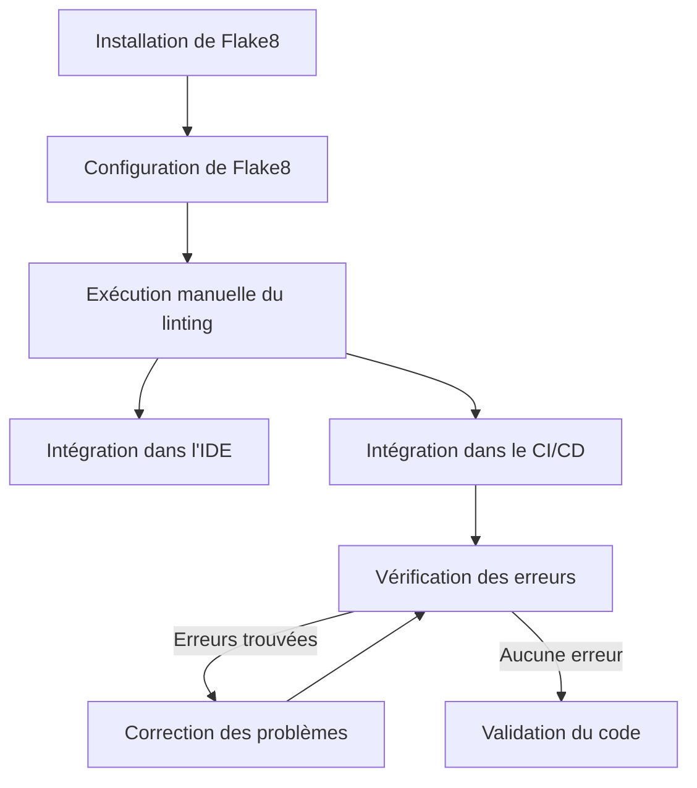
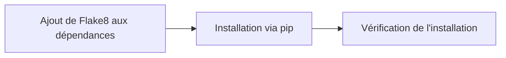
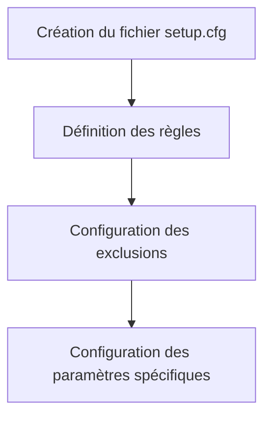
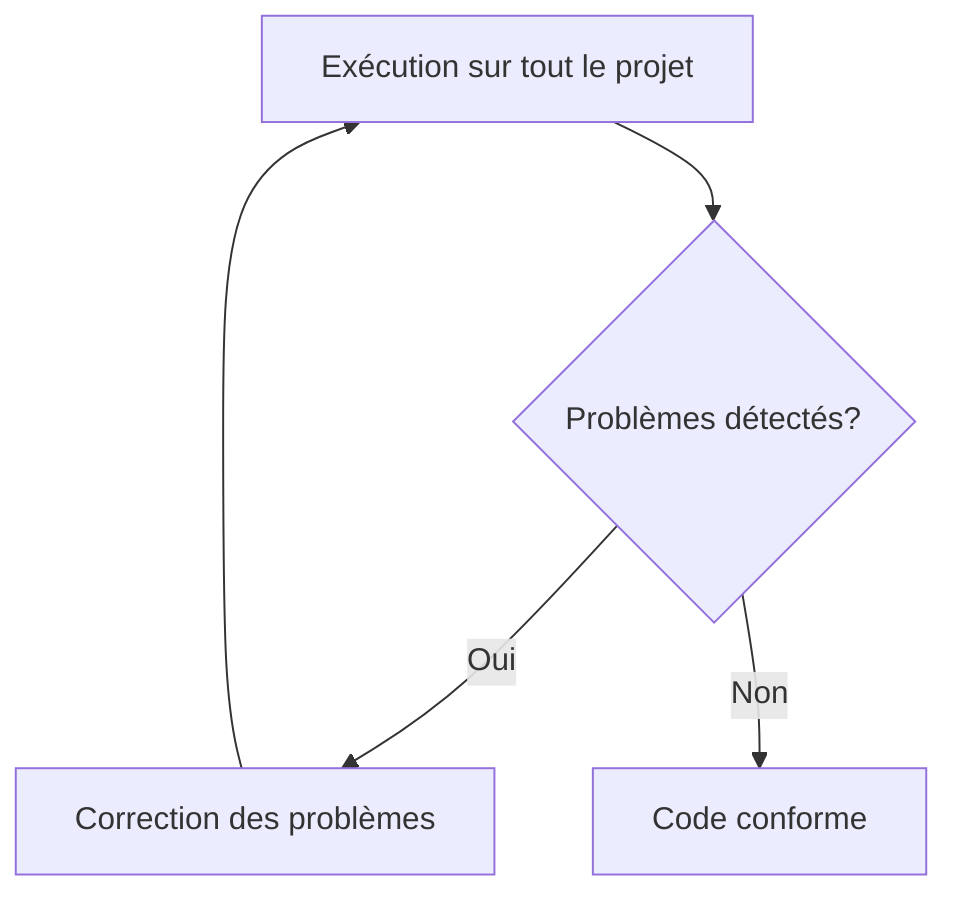
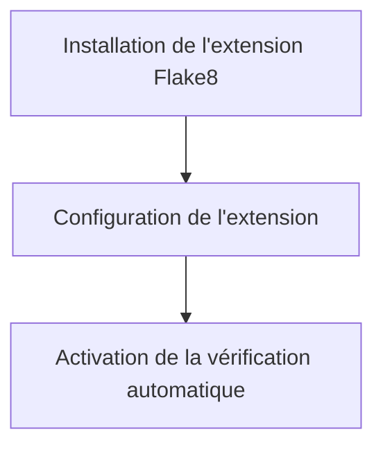
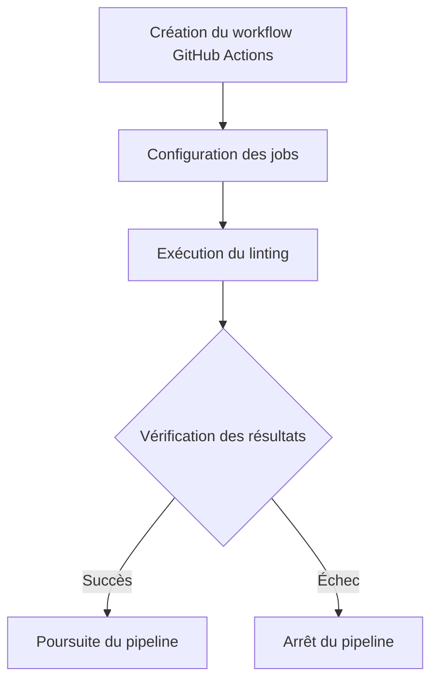
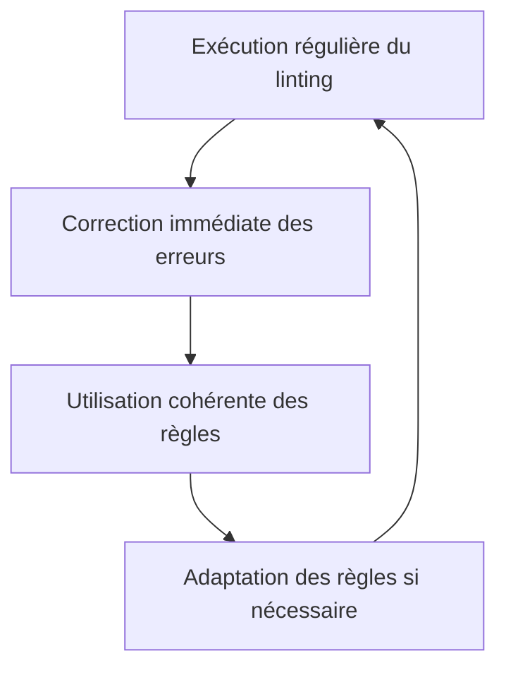

# Plan d'action pour la mise en place du linting avec Flake8

Ce document détaille la procédure pour mettre en place le linting avec Flake8 dans le projet Django.

## Qu'est-ce que le linting ?

Le linting est un processus d'analyse statique du code qui permet d'identifier les erreurs de programmation, les bugs potentiels, les problèmes de style et les constructions suspectes. Dans le contexte de Python, Flake8 est un outil populaire qui combine :

- PyFlakes (vérification syntaxique)
- pycodestyle (vérification de conformité PEP8)
- McCabe (vérification de complexité cyclomatique)

## Processus d'implémentation



## Étapes détaillées

### 1. Installation de Flake8



Actions à réaliser :

1. Ajouter Flake8 au fichier `requirements.txt` :
   ```
   flake8==6.1.0
   ```
2. Installer Flake8 :
   ```bash
   pip install -r requirements.txt
   ```
3. Vérifier l'installation :
   ```bash
   flake8 --version
   ```

### 2. Configuration de Flake8



Actions à réaliser :

1. Créer un fichier `.flake8` ou `setup.cfg` à la racine du projet avec la configuration suivante :

```ini
[flake8]
max-line-length = 100
exclude = 
    .git,
    __pycache__,
    */migrations/*,
    */static/*,
    */templates/*,
    .env,
    .venv,
    env/,
    venv/,
    ENV/
ignore = 
    E203,  # whitespace before ':'
    W503   # line break before binary operator
per-file-ignores =
    __init__.py:F401,F403
```

### 3. Exécution manuelle du linting



Actions à réaliser :

1. Exécuter Flake8 sur l'ensemble du projet :
   ```bash
   flake8 .
   ```
2. Exécuter Flake8 sur un module spécifique :
   ```bash
   flake8 core/
   ```

### 4. Intégration dans l'IDE (VSCode)



Actions à réaliser :

1. Installer l'extension Flake8 pour VSCode
2. Configurer les paramètres dans `settings.json` :
   ```json
   {
     "python.linting.enabled": true,
     "python.linting.flake8Enabled": true,
     "python.linting.flake8Path": "flake8"
   }
   ```

### 5. Intégration dans le CI/CD (GitHub Actions)



Actions à réaliser :

1. Créer un fichier de workflow GitHub Actions `.github/workflows/lint.yml` :
   ```yaml
   name: Lint

   on:
     push:
       branches: [ main, develop ]
     pull_request:
       branches: [ main, develop ]

   jobs:
     flake8:
       runs-on: ubuntu-latest
       steps:
       - uses: actions/checkout@v3
       - name: Set up Python
         uses: actions/setup-python@v4
         with:
           python-version: '3.10'
       - name: Install dependencies
         run: |
           python -m pip install --upgrade pip
           pip install -r requirements.txt
       - name: Lint with flake8
         run: |
           flake8 . --count --select=E9,F63,F7,F82 --show-source --statistics
           flake8 . --count --exit-zero --max-complexity=10 --statistics
   ```

## Bonnes pratiques pour le linting



1. Exécuter le linting régulièrement pendant le développement
2. Corriger immédiatement les problèmes détectés
3. Maintenir une configuration cohérente entre tous les développeurs
4. Adapter progressivement les règles en fonction des besoins spécifiques du projet

## Ressources utiles

- [Documentation officielle de Flake8](https://flake8.pycqa.org/)
- [Guide PEP8](https://www.python.org/dev/peps/pep-0008/)
- [Documentation GitHub Actions](https://docs.github.com/en/actions)