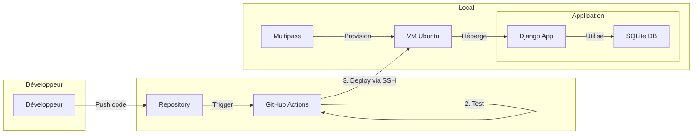
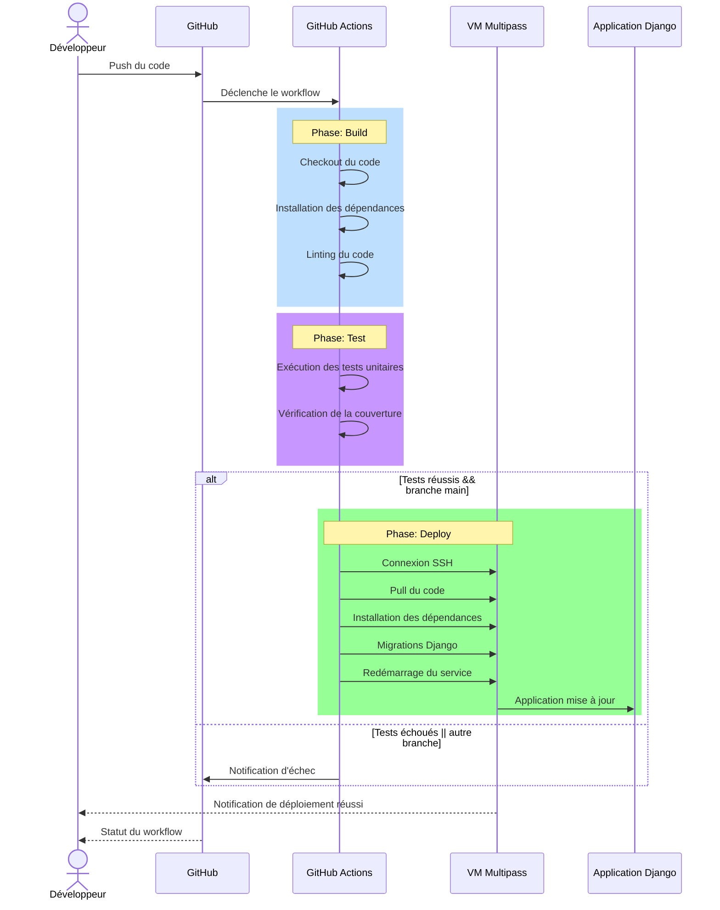

# Plan d'Action DevOps pour le CI/CD du projet Django-GH-Actions

Ce document présente un plan d'action complet pour la mise en place d'un pipeline CI/CD pour le projet Django-GH-Actions, avec un déploiement sur une VM locale provisionnée avec Multipass.

## Table des matières
- [Aperçu de la solution](#aperçu-de-la-solution)
- [Architecture du système](#architecture-du-système)
- [Flux de travail CI/CD](#flux-de-travail-cicd)
- [Étapes de mise en œuvre](#étapes-de-mise-en-œuvre)
  - [1. Configuration de l'environnement local](#1-configuration-de-lenvironnement-local)
  - [2. Configuration de la VM de déploiement](#2-configuration-de-la-vm-de-déploiement)
  - [3. Configuration de GitHub Actions](#3-configuration-de-github-actions)
  - [4. Configuration du déploiement automatisé](#4-configuration-du-déploiement-automatisé)
  - [5. Tests et validation](#5-tests-et-validation)
- [Bonnes pratiques et recommandations](#bonnes-pratiques-et-recommandations)
- [Maintenance et surveillance](#maintenance-et-surveillance)
- [Plan de rollback](#plan-de-rollback)
- [Conclusion](#conclusion)

## Aperçu de la solution

Notre solution CI/CD pour le projet Django-GH-Actions repose sur les éléments suivants :

- **GitHub Actions** : Pour l'automatisation du build, des tests et du déploiement
- **Multipass** : Pour la provision de la VM locale servant d'environnement de déploiement
- **Django** : Framework de notre application web
- **SSH** : Pour la communication sécurisée entre GitHub Actions et la VM de déploiement

Ce plan vise à mettre en place un flux de travail automatisé qui permettra :
- La validation du code à chaque push sur GitHub
- Les tests automatisés
- Le déploiement automatique sur l'environnement cible (VM Multipass)
- Une maintenance simplifiée avec possibilité de rollback

## Architecture du système

Voici l'architecture globale du système CI/CD :



## Flux de travail CI/CD

Le processus CI/CD complet se déroule comme suit :



## Étapes de mise en œuvre

### 1. Configuration de l'environnement local

#### a. Génération de la paire de clés SSH

```bash
# Génération de la clé SSH pour GitHub Actions
ssh-keygen -t rsa -b 4096 -f ~/.ssh/github_rsa
```

#### b. Création et configuration de la VM Multipass

```bash
# Création de la VM avec Multipass
multipass launch --name devops-dev-vm --cpus 1 --memory 500M --disk 10G

# Vérification de l'état de la VM
multipass info devops-dev-vm
```

### 2. Configuration de la VM de déploiement

#### a. Installation des prérequis sur la VM

```bash
# Connexion à la VM
multipass shell devops-dev-vm

# Installation des dépendances
sudo apt update
sudo apt install -y python3 python3-pip python3-venv git nginx supervisor

# Création de l'utilisateur d'application
sudo useradd -m -s /bin/bash django_app
```

#### b. Configuration de l'accès SSH

```bash
# Copie de la clé publique sur la VM
multipass transfer ~/.ssh/github_rsa.pub devops-dev-vm:~/github_rsa.pub

# Ajout de la clé à authorized_keys
sudo mkdir -p /home/ubuntu/.ssh
sudo cat ~/github_rsa.pub >> /home/ubuntu/.ssh/authorized_keys
sudo chmod 600 /home/ubuntu/.ssh/authorized_keys
sudo chmod 700 /home/ubuntu/.ssh
```

#### c. Configuration de l'environnement Django

```bash
ls /var/www/
# Création du répertoire de déploiement
sudo mkdir -p /var/www/django-app
sudo chown ubuntu:ubuntu /var/www/django-app

# Création de l'environnement virtuel
python3 -m venv /var/www/django-app/venv

# Clone du repository
cd /var/www/django-app
git clone https://github.com/tawounfouet/django-gh-actions.git app
cd app

# Installation des dépendances
/var/www/django-app/venv/bin/pip install -r requirements.txt

# Migrations et collecte des fichiers statiques
/var/www/django-app/venv/bin/python manage.py migrate
/var/www/django-app/venv/bin/python manage.py collectstatic --noinput
```

#### d. Configuration de Nginx

```bash
ls /etc/nginx/sites-available/

# Création du fichier de configuration Nginx
sudo tee /etc/nginx/sites-available/django-app <<EOF
server {
    listen 80;
    server_name _;

    location /static/ {
        alias /var/www/django-app/app/static/;
    }

    location / {
        proxy_pass http://127.0.0.1:8000;
        proxy_set_header Host \$host;
        proxy_set_header X-Real-IP \$remote_addr;
    }
}
EOF


# c
cat /etc/nginx/sites-available/django-app

# Activation du site
sudo ln -s /etc/nginx/sites-available/django-app /etc/nginx/sites-enabled/
sudo rm -f /etc/nginx/sites-enabled/default
sudo systemctl restart nginx
```

#### e. Configuration de Supervisor

```bash
ls /etc/supervisor/conf.d/

# Création du fichier de configuration Supervisor
sudo tee /etc/supervisor/conf.d/django-app.conf <<EOF
[program:django-app]
command=/var/www/django-app/venv/bin/gunicorn core.wsgi:application --bind 127.0.0.1:8000
directory=/var/www/django-app/app
user=ubuntu
autostart=true
autorestart=true
redirect_stderr=true
stdout_logfile=/var/www/django-app/logs/gunicorn.log
EOF


# cat /etc/supervisor/conf.d/django-app.conf

# Création du dossier de logs
mkdir -p /var/www/django-app/logs

# Installation de Gunicorn
/var/www/django-app/venv/bin/pip install gunicorn

# Démarrage du service
sudo supervisorctl reread
sudo supervisorctl update
sudo supervisorctl start django-app
```

### 3. Configuration de GitHub Actions

#### a. Création des secrets dans GitHub

Dans le repository GitHub, ajouter les secrets suivants :

- `SSH_PRIVATE_KEY`: Contenu de la clé privée (~/.ssh/github_rsa)
- `SSH_HOST`: Adresse IP de la VM Multipass (obtenue via `multipass info devops-dev-vm`)
- `SSH_USER`: Nom d'utilisateur (ubuntu)

#### b. Mise à jour du workflow GitHub Actions

Mettre à jour le fichier `.github/workflows/main.yml`:

```yaml
name: Build, Test and Deploy Django Application

on:
  push:
    branches: [ 'main' ]
  pull_request:
    branches: [ 'main' ]
  workflow_dispatch:
  schedule:
    - cron: '0 0 * * 0'  # Every Sunday at midnight UTC

jobs:
  build:
    runs-on: ubuntu-latest
    steps:
    - name: Checkout code
      uses: actions/checkout@v3

    - name: Set up Python
      uses: actions/setup-python@v4
      with:
        python-version: '3.11'

    - name: Install dependencies
      run: |
        python -m pip install --upgrade pip
        pip install -r requirements.txt
        pip install flake8

    - name: Run linting
      run: |
        flake8 . --count --select=E9,F63,F7,F82 --show-source --statistics

    # Cache dependencies for next jobs
    - name: Cache dependencies
      uses: actions/cache@v3
      with:
        path: ~/.cache/pip
        key: ${{ runner.os }}-pip-${{ hashFiles('**/requirements.txt') }}
        restore-keys: |
          ${{ runner.os }}-pip-

  test:
    needs: [build]
    runs-on: ubuntu-latest
    steps:
    - name: Checkout code
      uses: actions/checkout@v3
      
    - name: Set up Python
      uses: actions/setup-python@v4
      with:
        python-version: '3.11'
      
    # Restore cached dependencies
    - name: Cache dependencies
      uses: actions/cache@v3
      with:
        path: ~/.cache/pip
        key: ${{ runner.os }}-pip-${{ hashFiles('**/requirements.txt') }}
        restore-keys: |
          ${{ runner.os }}-pip-
      
    - name: Install dependencies
      run: |
        python -m pip install --upgrade pip
        pip install -r requirements.txt
        pip install coverage
      
    - name: Run tests with coverage
      run: |
        coverage run --source='.' manage.py test
        coverage report

  deploy:
    needs: [test]
    runs-on: ubuntu-latest
    if: github.ref == 'refs/heads/main'  # Only deploy from main branch
    steps:
    - name: Checkout code
      uses: actions/checkout@v3

    - name: Extract commit hash
      id: vars
      run: echo "commit=${GITHUB_SHA::8}" >> $GITHUB_OUTPUT

    - name: Set up SSH
      uses: webfactory/ssh-agent@v0.7.0
      with:
        ssh-private-key: ${{ secrets.SSH_PRIVATE_KEY }}

    - name: Add host key
      run: |
        mkdir -p ~/.ssh
        ssh-keyscan -t rsa ${{ secrets.SSH_HOST }} >> ~/.ssh/known_hosts

    - name: Deploy to server
      env:
        SSH_USER: ${{ secrets.SSH_USER }}
        SSH_HOST: ${{ secrets.SSH_HOST }}
        COMMIT_HASH: ${{ steps.vars.outputs.commit }}
      run: |
        ssh $SSH_USER@$SSH_HOST "cd /var/www/django-app/app && \
        git pull && \
        /var/www/django-app/venv/bin/pip install -r requirements.txt && \
        /var/www/django-app/venv/bin/python manage.py migrate && \
        /var/www/django-app/venv/bin/python manage.py collectstatic --noinput && \
        sudo supervisorctl restart django-app && \
        echo 'Deployed commit: $COMMIT_HASH'"
```

### 4. Configuration du déploiement automatisé

#### a. Script de déploiement sur la VM

Créer un script de déploiement sur la VM pour faciliter les déploiements manuels et automatisés :

```bash
# Créer le script de déploiement
cat > /var/www/django-app/deploy.sh << 'EOF'
#!/bin/bash

echo "Starting deployment..."
cd /var/www/django-app/app

echo "Pulling latest code..."
git pull

echo "Installing dependencies..."
/var/www/django-app/venv/bin/pip install -r requirements.txt

echo "Running migrations..."
/var/www/django-app/venv/bin/python manage.py migrate

echo "Collecting static files..."
/var/www/django-app/venv/bin/python manage.py collectstatic --noinput

echo "Restarting application..."
sudo supervisorctl restart django-app

echo "Deployment completed!"
EOF

# Rendre le script exécutable
chmod +x /var/www/django-app/deploy.sh
```

#### b. Configuration des permissions sudo

Pour permettre au script de déploiement de redémarrer le service sans mot de passe :

```bash
# Ajouter une entrée sudoers pour l'utilisateur ubuntu
echo 'ubuntu ALL=(ALL) NOPASSWD: /usr/bin/supervisorctl restart django-app' | sudo tee /etc/sudoers.d/ubuntu-supervisor
```

### 5. Tests et validation

#### a. Test manuel du déploiement

```bash
# Se connecter à la VM
ssh -i ~/.ssh/github_rsa ubuntu@<VM_IP>

# Exécuter le script de déploiement
/var/www/django-app/deploy.sh
```

#### b. Test du pipeline CI/CD complet

1. Faire une modification dans le code
2. Commiter et pousser vers GitHub
3. Observer l'exécution du workflow dans l'onglet "Actions" de GitHub
4. Vérifier que l'application a bien été déployée sur la VM

## Bonnes pratiques et recommandations

1. **Sécurité** :
   - Utiliser des secrets GitHub pour les informations sensibles
   - Limiter les permissions SSH au minimum nécessaire
   - Mettre en place un pare-feu sur la VM

2. **Optimisation** :
   - Utiliser le cache des dépendances pour accélérer les builds
   - Paralléliser les jobs quand c'est possible

3. **Qualité du code** :
   - Ajouter des étapes de linting et d'analyse de code
   - Maintenir une couverture de tests adéquate
   - Utiliser des hooks pre-commit localement

4. **Améliorations futures** :
   - Mettre en place des environnements multiples (dev, staging, prod)
   - Utiliser Docker pour une meilleure isolation et portabilité
   - Implémenter des déploiements blue/green pour zéro downtime

## Maintenance et surveillance

1. **Logs** :
   - Les logs de l'application sont disponibles dans `/var/www/django-app/logs/`
   - Les logs de déploiement sont visibles dans GitHub Actions

2. **Surveillance** :
   - Mettre en place une surveillance de base avec des vérifications de santé
   - Configurer des alertes en cas d'échec de déploiement

3. **Sauvegardes** :
   - Configurer des sauvegardes régulières de la base de données
   - Stocker les sauvegardes dans un emplacement sécurisé

## Plan de rollback

En cas d'échec de déploiement ou de problème avec une nouvelle version :

```bash
# Se connecter à la VM
ssh -i ~/.ssh/github_rsa ubuntu@<VM_IP>

# Revenir à une version précédente
cd /var/www/django-app/app
git log --oneline  # Identifier le commit précédent
git checkout <previous_commit_hash>

# Réappliquer les migrations si nécessaire
/var/www/django-app/venv/bin/python manage.py migrate

# Redémarrer l'application
sudo supervisorctl restart django-app
```

## Conclusion

Ce plan d'action fournit une solution CI/CD complète pour le projet Django-GH-Actions, en automatisant le processus de build, test et déploiement via GitHub Actions vers une VM locale provisionnée avec Multipass.

L'architecture proposée est simple mais robuste, adaptée à des projets Django de petite à moyenne taille. Elle peut être étendue et améliorée en fonction des besoins spécifiques du projet et de l'équipe de développement.

En suivant ce plan d'action, vous obtiendrez un pipeline CI/CD fonctionnel qui améliorera considérablement la productivité de l'équipe et la qualité du logiciel.

---

*Document créé le 2 juillet 2025 par un Architecte DevOps Senior*