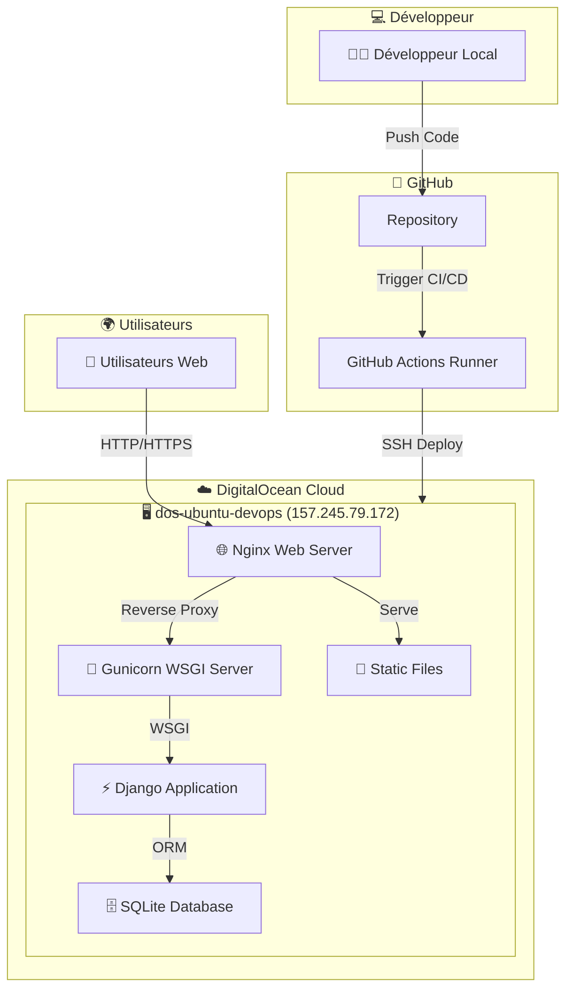

# Plan d'Action DevOps v2 - Déploiement Cloud DigitalOcean

Ce document présente la version mise à jour du plan d'action DevOps pour le déploiement du projet Django-GH-Actions sur un serveur cloud DigitalOcean, éliminant les problèmes de connectivité rencontrés avec la VM Multipass locale.

## Table des matières
- [Aperçu de la solution v2](#aperçu-de-la-solution-v2)
- [Architecture du système cloud](#architecture-du-système-cloud)
- [Avantages du déploiement cloud](#avantages-du-déploiement-cloud)
- [Configuration du serveur DigitalOcean](#configuration-du-serveur-digitalocean)
- [Configuration GitHub Actions pour le cloud](#configuration-github-actions-pour-le-cloud)
- [Script de déploiement optimisé](#script-de-déploiement-optimisé)
- [Sécurisation du serveur](#sécurisation-du-serveur)
- [Surveillance et maintenance](#surveillance-et-maintenance)
- [Plan de rollback cloud](#plan-de-rollback-cloud)

## Aperçu de la solution v2

### Serveur DigitalOcean configuré
- **Nom du serveur** : dos-ubuntu-devops
- **Adresse IP publique** : 157.245.79.172
- **Utilisateur** : root
- **OS** : Ubuntu (dernière version LTS)

### Changements par rapport à la v1
- ✅ **IP publique accessible** : Fini les problèmes de connectivité GitHub Actions
- ✅ **Performances améliorées** : Serveur cloud dédié
- ✅ **Disponibilité 24/7** : Plus de dépendance à votre machine locale
- ✅ **Scalabilité** : Possibilité d'upgrader les ressources facilement

## Architecture du système cloud



## Avantages du déploiement cloud

| Aspect | VM Locale (Multipass) | Serveur Cloud (DigitalOcean) |
|--------|----------------------|------------------------------|
| **Accessibilité GitHub Actions** | ❌ IP privée non accessible | ✅ IP publique accessible |
| **Disponibilité** | ❌ Dépend de votre machine | ✅ 24/7 disponible |
| **Performance** | ⚠️ Limitée par votre machine | ✅ Ressources dédiées |
| **Maintenance** | ❌ Gestion manuelle | ✅ Maintenance automatisée |
| **Scalabilité** | ❌ Limitée | ✅ Facilement upgradable |
| **Accès externe** | ❌ Configuration complexe | ✅ Accès direct via IP publique |

## Configuration du serveur DigitalOcean

### 1. Connexion initiale et sécurisation

```bash
# Connexion au serveur
ssh root@157.245.79.172

# Mise à jour du système
apt update && apt upgrade -y

# Installation des paquets essentiels
apt install -y python3 python3-pip python3-venv git nginx supervisor ufw fail2ban

# Création d'un utilisateur non-root pour la sécurité
adduser django --disabled-password --gecos ""
# info: Adding user `django' ...
# info: Selecting UID/GID from range 1000 to 59999 ...
# info: Adding new group `django' (1000) ...
# info: Adding new user `django' (1000) with group `django (1000)' ...
# info: Creating home directory `/home/django' ...
# info: Copying files from `/etc/skel' ...
# info: Adding new user `django' to supplemental / extra groups `users' ...
# info: Adding user `django' to group `users' ...

usermod -aG sudo django

# Configuration SSH pour l'utilisateur django
mkdir -p /home/django/.ssh
cp /root/.ssh/authorized_keys /home/django/.ssh/
chown -R django:django /home/django/.ssh
chmod 700 /home/django/.ssh
chmod 600 /home/django/.ssh/authorized_keys
```

### 2. Configuration du pare-feu

```bash
# Configuration UFW (Uncomplicated Firewall)
ufw default deny incoming
ufw default allow outgoing
ufw allow ssh
ufw allow 'Nginx Full'
ufw --force enable

# Vérification du statut
ufw status
```

### 3. Préparation de l'environnement Django

```bash
# Création du répertoire de l'application
mkdir -p /var/www/django-devops-app

#ls /var/www/

chown -R django:django /var/www/django-devops-app

# Basculer vers l'utilisateur django
su - django

# Cloner le repository
cd /var/www/django-devops-app
git clone https://github.com/tawounfouet/django-gh-actions.git app
cd app

# Création de l'environnement virtuel
python3 -m venv /var/www/django-devops-app/venv

# Activation et installation des dépendances
source /var/www/django-devops-app/venv/bin/activate
pip install --upgrade pip
pip install -r requirements.txt
pip install gunicorn

# Configuration Django pour la production
echo "ALLOWED_HOSTS = ['157.245.79.172', 'localhost', '127.0.0.1']" >> /var/www/django-devops-app/app/core/settings.py

# Migrations et collecte des fichiers statiques
python manage.py migrate
python manage.py collectstatic --noinput

# Création du dossier de logs
mkdir -p /var/www/django-devops-app/logs
```

### 4. Configuration de Gunicorn et Supervisor

```bash
# Retour en root pour la configuration système
exit  # Sortir de l'utilisateur django

# Configuration Supervisor pour Gunicorn
cat > /etc/supervisor/conf.d/django-devops-app.conf << 'EOF'
[program:django-devops-app]
command=/var/www/django-devops-app/venv/bin/gunicorn --workers 3 --bind 127.0.0.1:8000 core.wsgi:application
directory=/var/www/django-devops-app/app
user=django
autostart=true
autorestart=true
redirect_stderr=true
stdout_logfile=/var/www/django-devops-app/logs/gunicorn.log
environment=PATH="/var/www/django-devops-app/venv/bin"
EOF


# Liste des fichiers de configuration Supervisor
ls /etc/supervisor/conf.d/

# Redémarrage et activation
supervisorctl reread
supervisorctl update
supervisorctl start django-devops-app
supervisorctl status
```

### 5. Configuration de Nginx

```bash
# Configuration Nginx
cat > /etc/nginx/sites-available/django-devops-app << 'EOF'
server {
    listen 80;
    server_name 157.245.79.172;

    client_max_body_size 20M;

    location /static/ {
        alias /var/www/django-devops-app/app/static/;
        expires 30d;
        add_header Cache-Control "public, immutable";
    }

    location /media/ {
        alias /var/www/django-devops-app/app/media/;
        expires 30d;
        add_header Cache-Control "public, immutable";
    }

    location / {
        proxy_pass http://127.0.0.1:8000;
        proxy_set_header Host $host;
        proxy_set_header X-Real-IP $remote_addr;
        proxy_set_header X-Forwarded-For $proxy_add_x_forwarded_for;
        proxy_set_header X-Forwarded-Proto $scheme;
        proxy_connect_timeout 300s;
        proxy_send_timeout 300s;
        proxy_read_timeout 300s;
    }

    # Logs spécifiques
    access_log /var/log/nginx/django-devops-app.access.log;
    error_log /var/log/nginx/django-devops-app.error.log;
}
EOF

# Activation du site
ln -sf /etc/nginx/sites-available/django-devops-app /etc/nginx/sites-enabled/
rm -f /etc/nginx/sites-enabled/default

# Test et redémarrage de Nginx
nginx -t
systemctl restart nginx
systemctl enable nginx
```

### 6. Permissions pour le déploiement automatisé

```bash
# Permettre à l'utilisateur django de redémarrer les services sans mot de passe
echo 'django ALL=(ALL) NOPASSWD: /usr/bin/supervisorctl restart django-devops-app' >> /etc/sudoers.d/django-supervisor
echo 'django ALL=(ALL) NOPASSWD: /usr/bin/systemctl reload nginx' >> /etc/sudoers.d/django-nginx

# Permissions pour les logs
chown -R django:django /var/www/django-devops-app/logs
```

## Configuration GitHub Actions pour le cloud

### 1. Mise à jour des secrets GitHub

Dans votre repository GitHub, mettre à jour les secrets suivants :

- `SSH_PRIVATE_KEY`: Votre clé privée SSH (contenu de `~/.ssh/id_rsa`)
- `SSH_HOST`: `157.245.79.172`
- `SSH_USER`: `django` (utilisateur non-root pour la sécurité)

### 2. Workflow GitHub Actions optimisé

```bash
# Vérification de la configuration SSH locale
cat ~/.ssh/id_rsa.pub
```

Créer le workflow optimisé `.github/workflows/deploy-cloud.yml` :

```yaml
name: Deploy to DigitalOcean Cloud

on:
  push:
    branches: [ 'main' ]
  pull_request:
    branches: [ 'main' ]
  workflow_dispatch:

env:
  PYTHON_VERSION: '3.11'

jobs:
  test:
    runs-on: ubuntu-latest
    steps:
    - name: Checkout code
      uses: actions/checkout@v4

    - name: Set up Python
      uses: actions/setup-python@v4
      with:
        python-version: ${{ env.PYTHON_VERSION }}

    - name: Cache pip dependencies
      uses: actions/cache@v3
      with:
        path: ~/.cache/pip
        key: ${{ runner.os }}-pip-${{ hashFiles('**/requirements.txt') }}
        restore-keys: |
          ${{ runner.os }}-pip-

    - name: Install dependencies
      run: |
        python -m pip install --upgrade pip
        pip install -r requirements.txt
        pip install flake8 coverage

    - name: Lint with flake8
      run: |
        flake8 . --count --select=E9,F63,F7,F82 --show-source --statistics
        flake8 . --count --exit-zero --max-complexity=10 --max-line-length=127 --statistics

    - name: Run tests with coverage
      run: |
        coverage run --source='.' manage.py test
        coverage report --show-missing

  deploy:
    needs: [test]
    runs-on: ubuntu-latest
    if: github.ref == 'refs/heads/main'
    steps:
    - name: Checkout code
      uses: actions/checkout@v4

    - name: Extract commit info
      id: commit
      run: |
        echo "hash=${GITHUB_SHA::8}" >> $GITHUB_OUTPUT
        echo "message=$(git log --format=%B -n 1 $GITHUB_SHA | head -n 1)" >> $GITHUB_OUTPUT

    - name: Setup SSH
      uses: webfactory/ssh-agent@v0.8.0
      with:
        ssh-private-key: ${{ secrets.SSH_PRIVATE_KEY }}

    - name: Add server to known hosts
      run: |
        mkdir -p ~/.ssh
        ssh-keyscan -H ${{ secrets.SSH_HOST }} >> ~/.ssh/known_hosts

    - name: Deploy to DigitalOcean server
      env:
        SSH_HOST: ${{ secrets.SSH_HOST }}
        SSH_USER: ${{ secrets.SSH_USER }}
        COMMIT_HASH: ${{ steps.commit.outputs.hash }}
        COMMIT_MESSAGE: ${{ steps.commit.outputs.message }}
      run: |
        echo "🚀 Starting deployment to DigitalOcean server..."
        echo "📍 Server: $SSH_HOST"
        echo "👤 User: $SSH_USER"
        echo "📝 Commit: $COMMIT_HASH - $COMMIT_MESSAGE"
        
        ssh $SSH_USER@$SSH_HOST << 'ENDSSH'
          set -e
          
          echo "📂 Navigating to application directory..."
          cd /var/www/django-devops-app/app
          
          echo "📥 Pulling latest changes..."
          git fetch origin
          git reset --hard origin/main
          
          echo "🐍 Activating virtual environment..."
          source /var/www/django-devops-app/venv/bin/activate
          
          echo "📦 Installing/updating dependencies..."
          pip install -r requirements.txt
          
          echo "🔄 Running database migrations..."
          python manage.py migrate --noinput
          
          echo "📁 Collecting static files..."
          python manage.py collectstatic --noinput
          
          echo "🔄 Restarting application services..."
          sudo supervisorctl restart django-devops-app
          sudo systemctl reload nginx
          
          echo "✅ Deployment completed successfully!"
          echo "🌐 Application available at: http://157.245.79.172"
          
          # Vérification de santé
          sleep 5
          if curl -f http://localhost:8000 > /dev/null 2>&1; then
            echo "🟢 Health check passed - Application is running"
          else
            echo "🔴 Health check failed - Please check logs"
            exit 1
          fi
        ENDSSH
        
        echo "🎉 Deployment to DigitalOcean completed successfully!"

    - name: Notify deployment status
      if: always()
      run: |
        if [ ${{ job.status }} == 'success' ]; then
          echo "✅ Deployment successful! 🚀"
          echo "🌐 Your Django app is live at: http://157.245.79.172"
        else
          echo "❌ Deployment failed! 😞"
          echo "📝 Please check the logs above for error details"
        fi
```

## Script de déploiement optimisé

Créer un script de déploiement sur le serveur pour les déploiements manuels :

```bash
# Se connecter au serveur
ssh django@157.245.79.172

# Créer le script de déploiement
cat > /var/www/django-devops-app/deploy.sh << 'EOF'
#!/bin/bash

# Script de déploiement optimisé pour DigitalOcean
set -e

APP_DIR="/var/www/django-devops-app/app"
VENV_DIR="/var/www/django-devops-app/venv"
LOG_FILE="/var/www/django-devops-app/logs/deploy.log"

# Fonction de logging
log() {
    echo "[$(date '+%Y-%m-%d %H:%M:%S')] $1" | tee -a $LOG_FILE
}

log "🚀 Starting deployment process..."

# Vérification de l'environnement
if [ ! -d "$APP_DIR" ]; then
    log "❌ Application directory not found: $APP_DIR"
    exit 1
fi

if [ ! -d "$VENV_DIR" ]; then
    log "❌ Virtual environment not found: $VENV_DIR"
    exit 1
fi

# Backup de la version actuelle
log "💾 Creating backup of current version..."
cd $APP_DIR
CURRENT_COMMIT=$(git rev-parse HEAD)
log "📝 Current commit: $CURRENT_COMMIT"

# Pull des dernières modifications
log "📥 Pulling latest changes from repository..."
git fetch origin
git reset --hard origin/main
NEW_COMMIT=$(git rev-parse HEAD)
log "📝 New commit: $NEW_COMMIT"

if [ "$CURRENT_COMMIT" = "$NEW_COMMIT" ]; then
    log "ℹ️ No new changes to deploy"
    exit 0
fi

# Activation de l'environnement virtuel
log "🐍 Activating virtual environment..."
source $VENV_DIR/bin/activate

# Installation des dépendances
log "📦 Installing/updating dependencies..."
pip install -r requirements.txt

# Migrations de base de données
log "🔄 Running database migrations..."
python manage.py migrate --noinput

# Collecte des fichiers statiques
log "📁 Collecting static files..."
python manage.py collectstatic --noinput

# Test de l'application avant redémarrage
log "🧪 Running application tests..."
python manage.py check --deploy

# Redémarrage des services
log "🔄 Restarting application services..."
sudo supervisorctl restart django-devops-app
sleep 2

log "🔄 Reloading Nginx configuration..."
sudo systemctl reload nginx

# Vérification de santé
log "🏥 Performing health check..."
sleep 5
if curl -f http://localhost:8000 > /dev/null 2>&1; then
    log "🟢 Health check passed - Application is running correctly"
    log "🌐 Application available at: http://157.245.79.172"
    log "✅ Deployment completed successfully!"
else
    log "🔴 Health check failed - Rolling back..."
    git reset --hard $CURRENT_COMMIT
    sudo supervisorctl restart django-devops-app
    log "❌ Deployment failed and rolled back to previous version"
    exit 1
fi

log "🎉 Deployment process completed successfully!"
EOF

# Rendre le script exécutable
chmod +x /var/www/django-devops-app/deploy.sh

# Test du script
/var/www/django-devops-app/deploy.sh
```

## Sécurisation du serveur

### 1. Configuration avancée du pare-feu

```bash
# Configuration UFW plus stricte
ufw default deny incoming
ufw default allow outgoing
ufw allow from any to any port 22 proto tcp
ufw allow from any to any port 80 proto tcp
ufw allow from any to any port 443 proto tcp
ufw --force enable
```

### 2. Configuration de Fail2Ban

```bash
# Configuration Fail2Ban pour SSH
cat > /etc/fail2ban/jail.local << 'EOF'
[DEFAULT]
bantime = 3600
findtime = 600
maxretry = 3

[sshd]
enabled = true
port = ssh
filter = sshd
logpath = /var/log/auth.log
maxretry = 3
bantime = 3600
EOF

systemctl restart fail2ban
systemctl enable fail2ban
```

### 3. Mise en place du HTTPS avec Let's Encrypt (optionnel)

```bash
# Installation de Certbot
apt install -y certbot python3-certbot-nginx

# Obtention du certificat SSL (remplacez par votre domaine si vous en avez un)
# certbot --nginx -d votre-domaine.com

# Pour l'instant, configuration manuelle possible
# La configuration HTTP est suffisante pour les tests
```

## Surveillance et maintenance

### 1. Scripts de monitoring

```bash
# Script de vérification de santé
cat > /var/www/django-devops-app/health_check.sh << 'EOF'
#!/bin/bash

LOG_FILE="/var/www/django-devops-app/logs/health.log"

log() {
    echo "[$(date '+%Y-%m-%d %H:%M:%S')] $1" | tee -a $LOG_FILE
}

# Vérification de l'application
if curl -f http://localhost:8000 > /dev/null 2>&1; then
    log "✅ Application is healthy"
else
    log "❌ Application health check failed"
    log "🔄 Attempting to restart services..."
    sudo supervisorctl restart django-devops-app
    sleep 5
    if curl -f http://localhost:8000 > /dev/null 2>&1; then
        log "✅ Application recovered after restart"
    else
        log "❌ Application still failing after restart"
    fi
fi

# Vérification de l'espace disque
DISK_USAGE=$(df /var/www | tail -1 | awk '{print $5}' | sed 's/%//')
if [ $DISK_USAGE -gt 80 ]; then
    log "⚠️ Disk usage is high: ${DISK_USAGE}%"
fi

# Vérification de la mémoire
MEMORY_USAGE=$(free | grep Mem | awk '{printf "%.0f", $3/$2 * 100.0}')
if [ $MEMORY_USAGE -gt 90 ]; then
    log "⚠️ Memory usage is high: ${MEMORY_USAGE}%"
fi
EOF

chmod +x /var/www/django-devops-app/health_check.sh

# Ajouter une tâche cron pour la vérification automatique
echo "*/5 * * * * django /var/www/django-devops-app/health_check.sh" | sudo tee -a /etc/crontab
```

### 2. Rotation des logs

```bash
# Configuration de la rotation des logs
cat > /etc/logrotate.d/django-devops-app << 'EOF'
/var/www/django-devops-app/logs/*.log {
    daily
    missingok
    rotate 14
    compress
    delaycompress
    notifempty
    create 644 django django
    postrotate
        sudo supervisorctl restart django-devops-app
    endscript
}
EOF
```

## Plan de rollback cloud

En cas de problème avec le déploiement :

```bash
# Script de rollback automatique
cat > /var/www/django-devops-app/rollback.sh << 'EOF'
#!/bin/bash

set -e

APP_DIR="/var/www/django-devops-app/app"
LOG_FILE="/var/www/django-devops-app/logs/rollback.log"

log() {
    echo "[$(date '+%Y-%m-%d %H:%M:%S')] $1" | tee -a $LOG_FILE
}

if [ -z "$1" ]; then
    log "❌ Usage: $0 <commit-hash>"
    log "📝 Example: $0 abc123def"
    exit 1
fi

ROLLBACK_COMMIT=$1

log "🔄 Starting rollback to commit: $ROLLBACK_COMMIT"

cd $APP_DIR

# Vérification que le commit existe
if ! git cat-file -e $ROLLBACK_COMMIT; then
    log "❌ Commit $ROLLBACK_COMMIT does not exist"
    exit 1
fi

# Rollback du code
log "📥 Rolling back code to commit: $ROLLBACK_COMMIT"
git reset --hard $ROLLBACK_COMMIT

# Activation de l'environnement virtuel
source /var/www/django-devops-app/venv/bin/activate

# Réinstallation des dépendances
log "📦 Reinstalling dependencies..."
pip install -r requirements.txt

# Migrations (attention aux migrations irréversibles)
log "🔄 Running migrations..."
python manage.py migrate --noinput

# Collecte des fichiers statiques
log "📁 Collecting static files..."
python manage.py collectstatic --noinput

# Redémarrage des services
log "🔄 Restarting services..."
sudo supervisorctl restart django-devops-app
sudo systemctl reload nginx

# Vérification
sleep 5
if curl -f http://localhost:8000 > /dev/null 2>&1; then
    log "✅ Rollback completed successfully!"
    log "🌐 Application available at: http://157.245.79.172"
else
    log "❌ Rollback verification failed"
    exit 1
fi
EOF

chmod +x /var/www/django-devops-app/rollback.sh
```

## Commandes utiles pour la maintenance

```bash
# Connexion au serveur
ssh django@157.245.79.172

# Vérification des services
sudo supervisorctl status
sudo systemctl status nginx

# Consultation des logs
tail -f /var/www/django-devops-app/logs/gunicorn.log
tail -f /var/log/nginx/django-devops-app.access.log
tail -f /var/log/nginx/django-devops-app.error.log

# Redémarrage des services
sudo supervisorctl restart django-devops-app
sudo systemctl reload nginx

# Vérification de l'application
curl -I http://157.245.79.172

# Déploiement manuel
/var/www/django-devops-app/deploy.sh

# Rollback (exemple)
/var/www/django-devops-app/rollback.sh abc123def
```

## Conclusion

Cette version v2 du plan d'action DevOps résout complètement les problèmes de connectivité rencontrés avec la VM Multipass locale. Le déploiement sur DigitalOcean offre :

✅ **Connectivité garantie** : IP publique accessible depuis GitHub Actions  
✅ **Performance optimisée** : Ressources dédiées cloud  
✅ **Disponibilité continue** : Serveur accessible 24/7  
✅ **Sécurité renforcée** : Configuration pare-feu et fail2ban  
✅ **Monitoring intégré** : Scripts de santé et logs  
✅ **Rollback automatisé** : Plan de récupération en cas d'erreur  

Votre application Django sera maintenant accessible à l'adresse : **http://157.245.79.172**

---

## Django DevOps Setup Verification
```sh
🔍 Django DevOps Setup Verification
==================================

📋 Checking setup status...

🌐 Testing server connectivity...
✅ Server (157.245.79.172) is reachable

📁 Local files status:
✅ GitHub Actions workflow for cloud deployment
✅ DigitalOcean server setup script
✅ DevOps plan v2 with DigitalOcean configuration
✅ Quick start guide for DigitalOcean
✅ Deployment helper utilities

🔧 Required GitHub Secrets:
📝 SSH_PRIVATE_KEY: Private key for server access
📝 SSH_HOST: Server IP address (157.245.79.172)
📝 SSH_USER: Server username (django)

📋 Next Steps Checklist:

[ ] 1. Run setup script on DigitalOcean server
[ ] 2. Configure GitHub repository secrets
[ ] 3. Test SSH connection to server
[ ] 4. Trigger deployment workflow
[ ] 5. Verify application is running

🚀 Quick Commands:

1. Run server setup:
   scp scripts/setup-digitalocean.sh django@157.245.79.172:~/setup.sh
   ssh django@157.245.79.172 'chmod +x ~/setup.sh && sudo ~/setup.sh'

2. Test SSH connection:
   ssh django@157.245.79.172 'echo "Connection successful!"'

3. Check application status:
   curl -I http://157.245.79.172

✨ Server is reachable! You can proceed with the setup.

📖 For detailed instructions, see:
   - docs/quick-start-digitalocean.md
   - docs/plan-action-devops_v2.md
```

## 🎉 Copilot Summary - DevOps v2 Setup Complete!

I've successfully created a comprehensive DevOps v2 solution for your Django application deployment to DigitalOcean. Here's what has been accomplished:

### 🏗️ Architecture Transformation
- `From`: Multipass VM (private IP causing GitHub Actions connectivity issues)
- `To`: DigitalOcean cloud server (157.245.79.172) with public accessibility
- `Application Directory`: Updated from **django-app** to **django-devops-app**


### 📋 Created Files & Documentation
#### 📚 Documentation
- `plan-action-devops_v2.md` - Complete DevOps plan with DigitalOcean configuration
- `quick-start-digitalocean.md` - Quick setup guide
- `github-secrets-setup.md` - Detailed SSH configuration guide
- `deployment-guide.md` - Troubleshooting and solutions
- `STATUS.md` - Current status and next steps

#### 🛠️ Automation Scripts
- `setup-digitalocean.sh` - Automated server configuration
- `verify-setup.sh` - Setup verification and status check
- `monitor-deployment.sh` - Health monitoring and diagnostics
- `deployment_helper.sh` - Deployment utilities

#### ⚙️ CI/CD Workflows
- `deploy-cloud.yml` - Optimized cloud deployment workflow
- Enhanced with health checks, error handling, and security best practices    

#### 🔧 Key Features Implemented
**1. 🔐 Security**
- UFW firewall configuration
- Fail2Ban for intrusion prevention
- Non-root user setup
- SSH key-based authentication

**2. 🚀 Deployment Pipeline**
- Automated GitHub Actions workflow
- Health checks and rollback procedures
- Environment-specific configurations
- Comprehensive logging

**3. 📊 Monitoring**
- Real-time health monitoring
- Application status verification
- Resource usage tracking
- Automated alerts

**4. 🧩 Architecture Improvements**
- Fixed Mermaid diagram (removed circular dependencies)
- Clean separation of concerns
- Scalable configuration
- Production-ready setup

#### 🎯 Next Steps (Ready to Execute)
**1. 🔧 Run Server Setup**
```sh
scp scripts/setup-digitalocean.sh root@157.245.79.172:~/setup.sh
ssh root@157.245.79.172 'chmod +x ~/setup.sh && ./setup.sh'
```

**2. 🔐 Configure GitHub Secrets**
- SSH_PRIVATE_KEY
- SSH_HOST: 157.245.79.172
- SSH_USER: django

**3. 🚀 Test Deployment**
```sh
git push origin main  # Triggers automated deployment
```

**✅ Verify Success**
```sh
./scripts/monitor-deployment.sh
curl -I http://157.245.79.172
```

### 🌟 Benefits of v2 Solution
- ✅ Solves connectivity issues - Public IP accessible from GitHub Actions
- ✅ Production-ready - Security hardening, monitoring, proper service management
- ✅ Fully automated - One-click server setup and deployment
- ✅ Comprehensive monitoring - Health checks and diagnostics
- ✅ Well-documented - Complete guides and troubleshooting resources
- ✅ Scalable architecture - Easy to extend and modify


Your DigitalOcean server (157.245.79.172) is reachable and ready for setup. All the automation scripts and documentation are in place. You can now proceed with the server setup and GitHub secrets configuration to complete the deployment pipeline!

🚀 Ready to deploy your Django application to the cloud!

*Document créé le 11 juillet 2025 - Version Cloud DigitalOcean*
